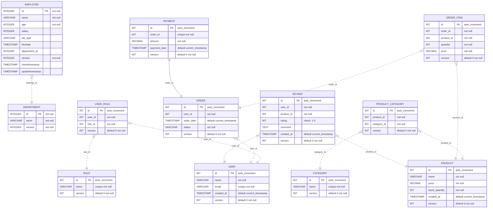

Simple Examples [](https://github.com/domaframework/simple-examples/actions?query=workflow%3A%22Java+CI+with+Gradle%22)
========================================

Simple examples for [Doma](https://github.com/domaframework/doma).

This repository includes the following examples:

* [example-sql-file](example-sql-file) - Uses SQL files to store SQL templates.
* [example-sql-annotation](example-sql-annotation) - Uses SQL annotations to store SQL templates.
* [example-criteria](example-criteria) - Uses the Criteria API.
* [example-jpms](example-jpms) - Uses the Java Platform Module System (JPMS).

ER diagram
---------------------

The ER diagram for the database used in the example projects is shown below.



Clone this repository
---------------------

```bash
$ git clone https://github.com/domaframework/simple-examples.git
$ cd simple-examples
```

Java version
------------

You need Java 17.

Build
-----

```bash
$ ./gradlew build
```

Import the project into your IDE
--------------------------------

### IDEA

Import the project as a Gradle project.

### Eclipse

Import the project as a Eclipse project.
